# Writeup

## Introduction

This project implements a semantic segmentation network using a encoder-decoder model.

Data used for training was provided by Udacity. I implemented custom data augmentation to achieve the target score. The model follows the architecture proposed in the project, with:
* Encoder blocks made of a separable convolution followed by batch normalization
* 1x1 convolution filters
* Decoder blocks made of upsampling, concatenation of the output of a previous layer, and separable convolutions with normalization.

## Architecture

Every block is followed by batch normalization. It helps the classifier by normalizing all block inputs to zero mean and unit variance. Training becomes much more efective and can be done with larger learning rates when employing normalization, since every layer becomes less dependant on the distribution of the previous layer. Normalization also helps reduce overfitting.

Separable convolutions were used in the model. Compared to conventional convolutions, they use less training parameters and are less prone to overfitting, and can improve runtime. A separable convolution makes use of the fact that some features observed by a convolution might be useful to multiple filters, and in a conventional convolutional layer some filters become be similar or can be represented as combinations of other filters. A separable convolution solves this problem by having less convolutions, followed by a cross-channel pooling of the convolutions (e.g. a 1x1 convolution).

#### 1x1 convolutions

The 1x1 convolutions are an option of channel pooling, leading to the dimentionality reduction. It works as a common convolution, but acting on a single pixel a time instead of a bidimensional kernel. The weighted sum of the filters in a given pixel then goes through a non-linear activation (ReLU was used in my network). Compared to the more classical pooling options (such as average and max), the 1x1 convolution can learn how much weight to apply to each filter. The 1x1 convolution is an effective pooling technique and, when compared to larger convolutions, lead to less overfitting due to the reduced number of parameters.

The following helper functions were used:

```python
def separable_conv2d_batchnorm(input_layer, filters, strides=1):
    output_layer = SeparableConv2DKeras(filters=filters,kernel_size=3, strides=strides,
                             padding='same', activation='relu')(input_layer)

    output_layer = layers.BatchNormalization()(output_layer)
    return output_layer


def conv2d_batchnorm(input_layer, filters, kernel_size=3, strides=1):
    output_layer = layers.Conv2D(filters=filters, kernel_size=kernel_size, strides=strides,
                      padding='same', activation='relu')(input_layer)

    output_layer = layers.BatchNormalization()(output_layer)
    return output_layer
```

I chose my encoder block to be a separable convolution followed by batch normalization:

```python
def encoder_block(input_layer, filters, strides):
    output_layer = separable_conv2d_batchnorm(input_layer, filters, strides)
    return output_layer
```

The encoder blocks will lead to increased "depth" for the next layers (more matrices being output by multiple filters) while reducing the area (resolution) of each matrix. The goal is to have more relevant and condensed localized data at each encoder.

The decoder applies upsampling to the previous layer, concatenation with a layer from the encoding stage (which works similar to step connections, giving more localized data to the decoder), and two separable convolutions with batch normalization. A helper function was used for upsampling with a bilinear filter:

```python
def bilinear_upsample(input_layer):
    output_layer = BilinearUpSampling2D((2,2))(input_layer)
    return output_layer
```

```python
def decoder_block(small_ip_layer, large_ip_layer, filters):
    upsampled = bilinear_upsample(small_ip_layer)
    output_layer = layers.concatenate([upsampled, large_ip_layer])

    output_layer = separable_conv2d_batchnorm(output_layer, filters)
    output_layer = separable_conv2d_batchnorm(output_layer, filters)

    return output_layer
```

The decoder will do the inverse process of the encoder, leading to less matrices with more area (higher resolution) at each block. The goal of the encoders is to transform the high density and relevant data contained in the multiple layers into fewer layers with higher resolution. Higher resolutions are achieved with upsampling. Furthermore, we use layer concatenation to pass some information from previous encoders. This way, an encoder receives the highly processed and relevant data, but also higher resolution and less processed data from a previous block. This helps the encoder detect the exact boundaries of the target when doing segmentation, since it has access to less processed data that is closer to the original image.

I used a model with a large number of filters. I started with 4 encoder and 4 decoder blocks, with a 1x1 convolution with 64 filters. A final layer with softmax activation and a 1x1 kernel will receive, for each pixel, the results of the 64 filters for that position and put the pixel in one of the three classes:

```python
def fcn_model(inputs, num_classes):
    encoded_1 = encoder_block(inputs, 64, 2)
    encoded_2 = encoder_block(encoded_1, 128, 2)
    encoded_3 = encoder_block(encoded_2, 256, 2)
    encoded_4 = encoder_block(encoded_3, 512, 2)

    one_by_one_convoluted = conv2d_batchnorm(encoded_4, 64, kernel_size=1, strides=1)

    decoded_4 = decoder_block(one_by_one_convoluted, encoded_3, 512)
    decoded_3 = decoder_block(decoded_4, encoded_2, 256)
    decoded_2 = decoder_block(decoded_3, encoded_1, 128)
    x = decoder_block(decoded_2, inputs, 64)

    return layers.Conv2D(num_classes, 1, activation='softmax', padding='same')(x)
```

#### Fully connected layers

A fully connected layer connects all inputs to each neuron to generate outputs. It is one of the primitives of neural networks. It is not suitable for use in most stages of image processing due to the excessive number of parameters and operations, which would lead to poor runtime performance and strong overfitting; furthermore, using it would make it harder for the network to learn localized data. However, it is used in some applications, such as the final layers of a classification network; after a series of convolutions, a fully connected layer is used to put the image on a class based on knoledge of all the output from the last convolutional layer. A classical fully connected layer was not used in my network.

## Hyper parameters and training

I didn't have a baseline of values to train with, so for my first testing I followed the recommended values in Keras documentation. I used the [default learning rate for the Adam optimizer](https://keras.io/optimizers/#adam) (0.001). I used the largest batch size that could fit in GPU memory (the training was run in an AWS machine with a K80 GPU, and I could use 75 images in a batch), started with 40 epochs, used the [recommended number of steps per epoch to cover all samples](https://keras.io/models/sequential/) (number of training samples divided by batch size), 50 validation steps and 2 workers.

```python
learning_rate = 0.001
batch_size = 75
num_epochs = 40
steps_per_epoch = 4131 // batch_size
validation_steps = 50
workers = 2
```

I noticed that the learning rate was too large, and after epoch 30 the training loss was oscillating more than decreasing. The training loss was also considerably lower than the validation loss and the validation loss oscillated wildly between epochs, indicating strong overfit.

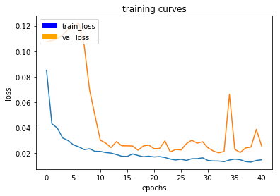

I decided to lower the learning rate and keep training this model to see if something interesting happened, but it kept mostly oscillating. The validation loss would sometimes reach peaks:

```python
model.optimizer.lr.assign(0.0004)
model.fit_generator(train_iter,
                    steps_per_epoch = steps_per_epoch,
                    epochs = 62,
                    validation_data = val_iter,
                    validation_steps = validation_steps,
                    callbacks=callbacks,
                    workers = workers,
                    initial_epoch=40,
)
```

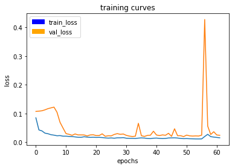

This network achieved a score of 0.3352:

```
# Quad following behind the target.
number of validation samples intersection over the union evaulated on 542
average intersection over union for background is 0.9890993734177407
average intersection over union for other people is 0.293868518819051
average intersection over union for the hero is 0.7608347408533
number true positives: 539, number false positives: 1, number false negatives: 0

# Quad on patrol and the target is not visible
number of validation samples intersection over the union evaulated on 270
average intersection over union for background is 0.9873095296771562
average intersection over union for other people is 0.6101332511933006
average intersection over union for the hero is 0.0
number true positives: 0, number false positives: 226, number false negatives: 0

# Target far away
number of validation samples intersection over the union evaulated on 322
average intersection over union for background is 0.9953643372345549
average intersection over union for other people is 0.38866362551249534
average intersection over union for the hero is 0.22603038191981709
number true positives: 192, number false positives: 9, number false negatives: 109

# Score weight
0.679368029739777

# IoU (datasets that never include the hero are excluded from grading)
0.493432561387

# Final score
0.335222307039
```

Some of the outputs of this initial model are:

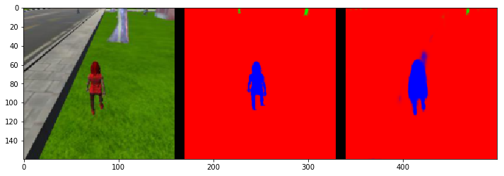
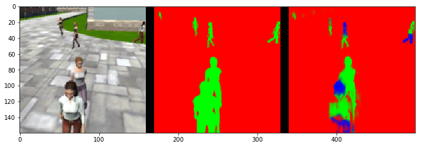
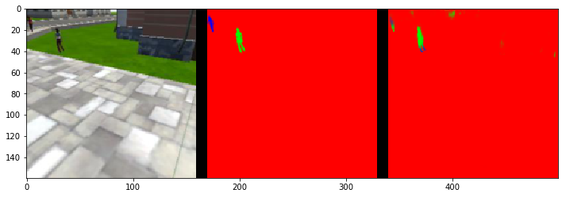
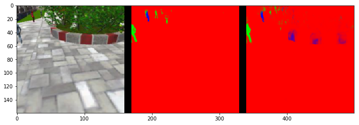

## Augmentation

I decided I'd rather code data augmentation techniques first before trying to collect more data. It turns out more data wasn't required after data augmentation.

Data augmentation was implemented in `data_iterator.py`. My initial plan was to use one of Keras' classes for data augmentation (such as [ImageDataGenerator](https://keras.io/preprocessing/image/)), which have many options to configure augmentation. However, since we are using a custom iterator, implementing simple augmentation techniques manually seemed easier.

I implemented random horizontal flip and rotation (between -5 and +5 degrees) of the image:

```
diff --git a/code/utils/data_iterator.py b/code/utils/data_iterator.py
index 7cbb8f4..ed161ba 100644
--- a/code/utils/data_iterator.py
+++ b/code/utils/data_iterator.py
@@ -28,8 +28,10 @@
 # Author: Devin Anzelmo

 import os
+import random
 from glob import glob
 from scipy import misc
+from scipy.ndimage import interpolation

 import numpy as np
 from tensorflow.contrib.keras.python.keras.preprocessing.image import Iterator
@@ -61,27 +63,15 @@ def get_patches(image, image_mask):
     return small_im, small_mask


-def shift_and_pad_augmentation(image, image_mask):
-    shape = image.shape
-    new_im = np.zeros(shape)
-    new_mask = np.zeros(image_mask.shape)
-    new_mask[:,:,0] = 1
-
-    im_patch, mask_patch = get_patches(image, image_mask)
-    patch_shape = im_patch.shape
-
-    ul_y = np.random.randint(0, shape[0]-patch_shape[0])
-    ul_x = np.random.randint(0, shape[1]-patch_shape[1])
-
-    new_im[ul_y:ul_y+patch_shape[0],
-           ul_x:ul_x+patch_shape[1],
-           :] = im_patch
-
-    new_mask[ul_y:ul_y+patch_shape[0],
-             ul_x:ul_x+patch_shape[1],
-             :] = mask_patch
+def augmentation(image, image_mask):
+    if random.choice([True, False]):
+        image = np.fliplr(image)
+        image_mask = np.fliplr(image_mask)

-    return new_im, new_mask
+    def rotate(source, angle):
+        return interpolation.rotate(source, angle, reshape=False, mode='nearest')
+    rotation = random.uniform(-5, 5)
+    return rotate(image, rotation), rotate(image_mask, rotation)


 class BatchIteratorSimple(Iterator):
@@ -149,8 +139,8 @@ class BatchIteratorSimple(Iterator):
                 if gt_image.shape[0] != self.image_shape[0]:
                     gt_image = misc.imresize(gt_image, self.image_shape)

-                #if self.shift_aug:
-                #    image, gt_image = shift_and_pad_augmentation(image, gt_image)
+                if self.shift_aug:
+                   image, gt_image = augmentation(image, gt_image)

                 image = preprocess_input(image.astype(np.float32))
                 batch_x[e,:,:,:] = image
```

## Final results of the smaller network

With data augmentation, this model performed just short of the 0.4 score, with 0.3987. Overfit was lower, but the validation score still oscillated. I strongly believe it can perform more than 0.4 by lowering the learning rate, adding epochs or adding more data focusing on the parts that are difficult for the network, but I decided to try a larger model to have a good margin above the minimum score.

```
# Quad following behind the target.
number of validation samples intersection over the union evaulated on 542
average intersection over union for background is 0.9952939200409372
average intersection over union for other people is 0.38807138742009706
average intersection over union for the hero is 0.9156748415864322
number true positives: 539, number false positives: 0, number false negatives: 0

# Quad on patrol and the target is not visible
number of validation samples intersection over the union evaulated on 270
average intersection over union for background is 0.9889931156354399
average intersection over union for other people is 0.7745639108137417
average intersection over union for the hero is 0.0
number true positives: 0, number false positives: 78, number false negatives: 0

# Target far away
number of validation samples intersection over the union evaulated on 322
average intersection over union for background is 0.9960726060183914
average intersection over union for other people is 0.44133828437779005
average intersection over union for the hero is 0.20098167763849986
number true positives: 118, number false positives: 2, number false negatives: 183

# Score weight
0.7141304347826087

# IoU (datasets that never include the hero are excluded from grading)
0.558328259612

# Final score
0.398719202788
```

The following segmented images were output by this network:

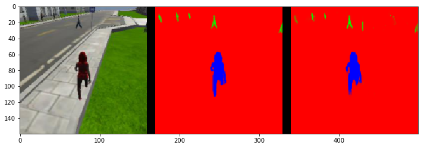
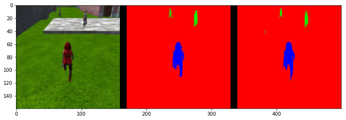
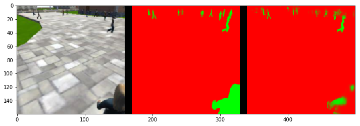
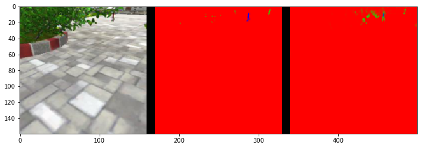

## Larger model

I made the 1x1 convolution larger (128 filters) and changed hyper parameters to pass the score.

The final network architecture is:

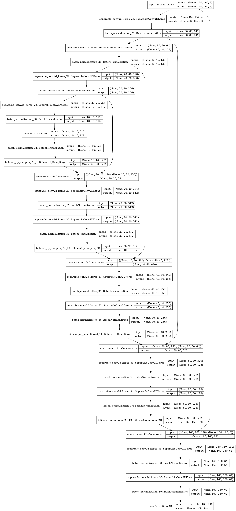

```
Layer (type)                 Output Shape              Param #   
=================================================================
input_3 (InputLayer)         (None, 160, 160, 3)       0         
_________________________________________________________________
separable_conv2d_keras_25 (S (None, 80, 80, 64)        283       
_________________________________________________________________
batch_normalization_27 (Batc (None, 80, 80, 64)        256       
_________________________________________________________________
separable_conv2d_keras_26 (S (None, 40, 40, 128)       8896      
_________________________________________________________________
batch_normalization_28 (Batc (None, 40, 40, 128)       512       
_________________________________________________________________
separable_conv2d_keras_27 (S (None, 20, 20, 256)       34176     
_________________________________________________________________
batch_normalization_29 (Batc (None, 20, 20, 256)       1024      
_________________________________________________________________
separable_conv2d_keras_28 (S (None, 10, 10, 512)       133888    
_________________________________________________________________
batch_normalization_30 (Batc (None, 10, 10, 512)       2048      
_________________________________________________________________
conv2d_5 (Conv2D)            (None, 10, 10, 128)       65664     
_________________________________________________________________
batch_normalization_31 (Batc (None, 10, 10, 128)       512       
_________________________________________________________________
bilinear_up_sampling2d_9 (Bi (None, 20, 20, 128)       0         
_________________________________________________________________
concatenate_9 (Concatenate)  (None, 20, 20, 384)       0         
_________________________________________________________________
separable_conv2d_keras_29 (S (None, 20, 20, 512)       200576    
_________________________________________________________________
batch_normalization_32 (Batc (None, 20, 20, 512)       2048      
_________________________________________________________________
separable_conv2d_keras_30 (S (None, 20, 20, 512)       267264    
_________________________________________________________________
batch_normalization_33 (Batc (None, 20, 20, 512)       2048      
_________________________________________________________________
bilinear_up_sampling2d_10 (B (None, 40, 40, 512)       0         
_________________________________________________________________
concatenate_10 (Concatenate) (None, 40, 40, 640)       0         
_________________________________________________________________
separable_conv2d_keras_31 (S (None, 40, 40, 256)       169856    
_________________________________________________________________
batch_normalization_34 (Batc (None, 40, 40, 256)       1024      
_________________________________________________________________
separable_conv2d_keras_32 (S (None, 40, 40, 256)       68096     
_________________________________________________________________
batch_normalization_35 (Batc (None, 40, 40, 256)       1024      
_________________________________________________________________
bilinear_up_sampling2d_11 (B (None, 80, 80, 256)       0         
_________________________________________________________________
concatenate_11 (Concatenate) (None, 80, 80, 320)       0         
_________________________________________________________________
separable_conv2d_keras_33 (S (None, 80, 80, 128)       43968     
_________________________________________________________________
batch_normalization_36 (Batc (None, 80, 80, 128)       512       
_________________________________________________________________
separable_conv2d_keras_34 (S (None, 80, 80, 128)       17664     
_________________________________________________________________
batch_normalization_37 (Batc (None, 80, 80, 128)       512       
_________________________________________________________________
bilinear_up_sampling2d_12 (B (None, 160, 160, 128)     0         
_________________________________________________________________
concatenate_12 (Concatenate) (None, 160, 160, 131)     0         
_________________________________________________________________
separable_conv2d_keras_35 (S (None, 160, 160, 64)      9627      
_________________________________________________________________
batch_normalization_38 (Batc (None, 160, 160, 64)      256       
_________________________________________________________________
separable_conv2d_keras_36 (S (None, 160, 160, 64)      4736      
_________________________________________________________________
batch_normalization_39 (Batc (None, 160, 160, 64)      256       
_________________________________________________________________
conv2d_6 (Conv2D)            (None, 160, 160, 3)       195       
=================================================================
Total params: 1,036,921
Trainable params: 1,030,905
Non-trainable params: 6,016
_________________________________________________________________
```

## Hyper parameters

The hyper parameters were changed for the final run. The training rate was lowered, epochs were added, and validation steps were added. The documentation for `validation_steps` states:

> It should typically be equal to the number of unique samples of your dataset divided by the batch size.

However, I made it larger. The reduced learning rate and increased validation steps helped lower the oscillations in the validation score:

```python
learning_rate = 0.0004
batch_size = 73
num_epochs = 70
steps_per_epoch = (4131 // batch_size) + 1
validation_steps = 100
workers = 2
```

## Final results

The loss curve for the final network was:

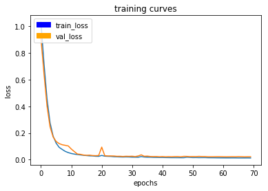

The final training loss was 0.0127 and the validation loss was 0.0219. There is still a overfitting of the training data as the validation loss is 72% greater than the training loss, but the network was good enough for the specified task.

I decided to continue training with a lower learning rate for 10 epochs to see if the network would learn more. The training loss decreased, but the validation loss moved randomly. I stopped, since I didn't think I would be able to improve more without more data.

```python
model.optimizer.lr.assign(0.0004)
model.fit_generator(train_iter,
                    steps_per_epoch = steps_per_epoch,
                    epochs = 80,
                    validation_data = val_iter,
                    validation_steps = validation_steps,
                    callbacks=callbacks,
                    workers = workers,
                    initial_epoch=70,
)
```

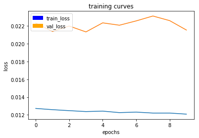

Adding filters to the 1x1 convolution, playing with hyper parameters and implementing data augmentation was enough to pass with a good margin, with a final score of 0.4302. The loss graphs were also much prettier, showing low overfit and oscillations. Adding more data would help my network, but was not required.

```
# Quad following behind the target.
number of validation samples intersection over the union evaulated on 542
average intersection over union for background is 0.9962776042691446
average intersection over union for other people is 0.383346667527765
average intersection over union for the hero is 0.9200759268289602
number true positives: 539, number false positives: 0, number false negatives: 0
# Quad on patrol and the target is not visible
number of validation samples intersection over the union evaulated on 270
average intersection over union for background is 0.9903743098169467
average intersection over union for other people is 0.799188786554657
average intersection over union for the hero is 0.0
number true positives: 0, number false positives: 40, number false negatives: 0
# Target far away
number of validation samples intersection over the union evaulated on 322
average intersection over union for background is 0.9970008432494347
average intersection over union for other people is 0.46497820047106303
average intersection over union for the hero is 0.22018435279064733
number true positives: 125, number false positives: 0, number false negatives: 176
# Score weight
0.7545454545454545
# IoU (datasets that never include the hero are excluded from grading)
0.57013013981
# Final score
0.430189105493
```
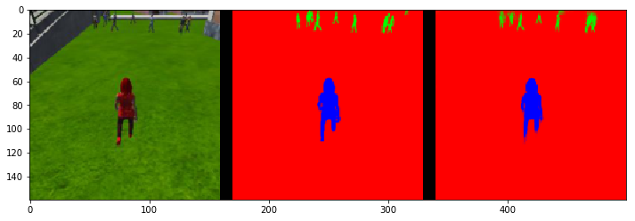
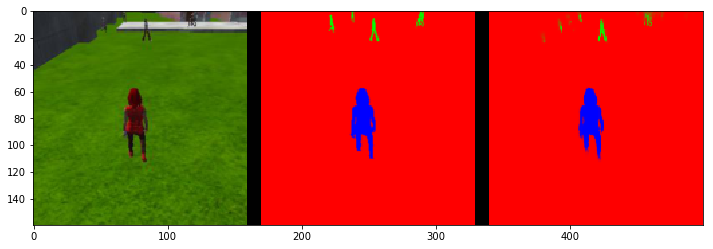
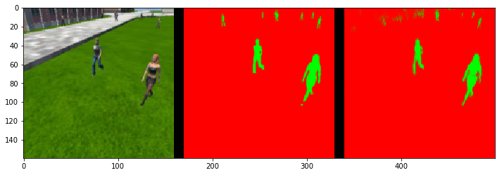
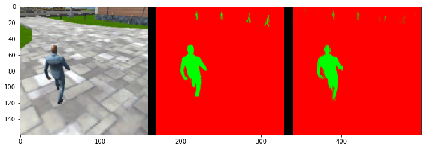
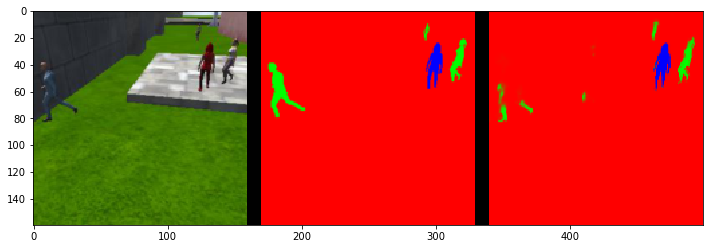

## Testing in the simulator

I ran my network in the simulator for testing. It performed well for people close to the camera, but failed in some of the far away detections. From far away, doors or noise would often be classified as people.

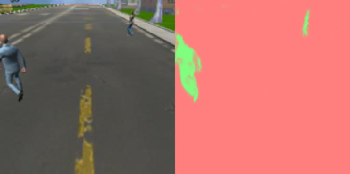
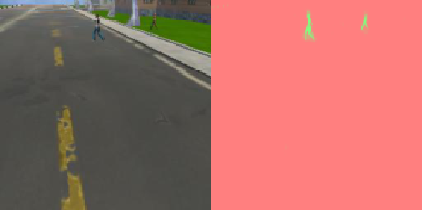
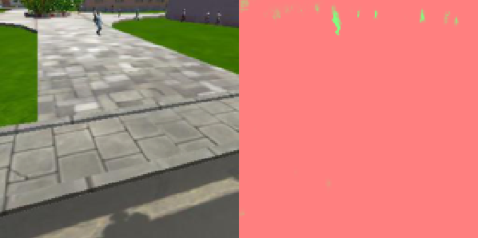
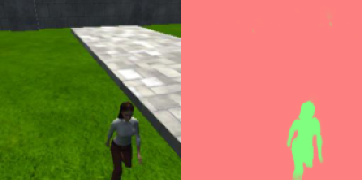
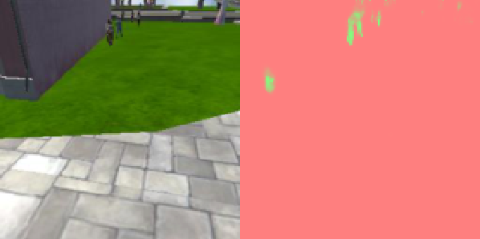

## Future enhancements

* The target score can be achieved with much less parameters and a smaller network. The large decoder block with 512 filters adds many trainable parameters to the model, with each of its separable convolutions having more than 200000 parameters. Reducing the decoder blocks would make training and inference much faster. However, I didn't optimize for runtime performance.

* I followed the recommended architecture of the encoder and decoder blocks. Trying other architectures would be interesting and could generate better results.

* Collecting more data, focusing on the configurations that are hard for the network, would probably help training a lot.

* I didn't fiddle with the optimizer too much. Training might be faster with a custom optimizer or custom settings.

## Limitations of the models

The same model could be trained to classify pixels into more classes by changing the last convolution with softmax to output more classes. For example, this model could detect humans and dogs. I believe it is deep enough to output more classes with few changes, other than the final layer. However, to use it on a real robot in real time, the model would have to be reduced. Furthermore, more training samples would be required to improve its score, and much more to train on more classes.

Another problem to consider is that adding more classes might incur in recollection or relabelling of existing data. For example, if we were to detect both people and cars, the existing images containing cars would have to be labelled again, else the car would be marked as background.

## Model and parameters

The model and weights can be found in the [data/weights](data/weights) folder. The jupyter notebook in [code/model_training.ipynb](code/model_training.ipynb) was used for training has the graphs and results
